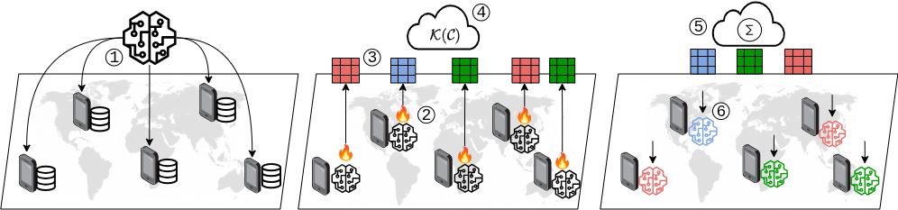

# Leveraging Federated Learning for Multilingual and Private Language Models via Model Clustering

*Abstract:*
Large Language Models (LLMs) have been increasingly applied across diverse applications worldwide and serve users from numerous countries spanning a wide variety of languages. However, the state-of-the-art models have a performance gap in several languages, mainly in the low-resource ones. This happens due to the difficulty in obtaining high-quality in-domain data from these languages that are poorly represented on today's open datasets. 
Thus, this paper proposes FedMLLM, a Federated Learning (FL) approach that allows access to more data by distributed training of the language model. Additionally, to avoid harm in performance due to aggregating several divert domains, FedMLLM applies a fully unsupervised model clustering, increasing the specialization while maintaining client collaboration. Performance evaluation results demonstrate that FedMLLM consistently outperforms traditional FL baselines in various multilingual and heterogeneous settings. This poses a way to leverage collaboration between users from several nations while increasing the quality of language models across under-represented languages.




*Obs: Code adapted from **OpenFedLLM**: a open-source research-use codebase for training *Large Language Models (LLM)* via federated learning. Please check our [paper](https://arxiv.org/abs/2402.06954) for details*

## Setup

Clone the repo, submodules and install the required packages.

```
git clone https://github.com/GabrielTalasso/FL-LLM-AD.git
cd FedMLLM
pip install -r requirements.txt
```

## Training

We provide training scripts under `training_scripts/`. Try them out from the top-level directory of this repository.

### Federated Instruction Tuning

The training script is in `training_scripts/run_sft_clustered.sh`.

Key arguments:

- `model_name_or_path`: the name or local location of your base model
- `template`: template for chatting. Define your own template in `utils/template.py`.
- `dataset_name`: the name of dataset. You may modify `utils/process_dataset.py` if your interested dataset has not been supported.
- `dataset_sample`: needed if you want to sample a specific number of samples from the original dataset.
- `fed_alg`: the name of federated learning algorithm
- `num_clients`/sample_clients: `num_clients` clients in total, `sample_clients` clients for each round
- `max_steps`: the number of model update steps for one client at each round.
- `sim_round`: round that clustering occurs 
- `n_clusters` number of clusters created 
- `split_strategy`: dataset split type (IID, multi domains, etc...)

## Citation

Please cite our paper if you find the repository helpful.

```
```
